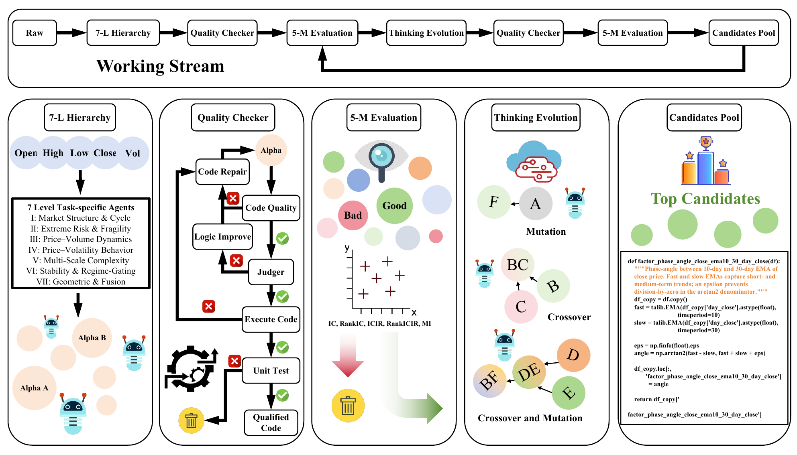

# Cognitive Alpha Mining via LLM-Driven Code-Based Evolution



[Paper](https://arxiv.org/abs/2511.18850)

CogAlpha is a cognitive alpha-mining framework that combines code-level alpha representation, LLM-driven reasoning, and evolutionary search. It uses specialized agents to generate, check, repair, refine, mutate, and recombine alpha factor code through multi-stage prompts and feedback from prior generations.

## CogAlpha Prompt Templates

This repository contains the public prompt templates used by **CogAlpha** for LLM-driven alpha factor discovery.

The templates are organized around three prompt families described in the paper:

- **Seven-Level Agent Hierarchy**: task-specific alpha generation prompts and shared generation blocks.
- **Multi-Agent Quality Checker**: code review, repair, logical judgment, and logic-improvement prompts.
- **Thinking Evolution**: mutation and crossover prompts for evolutionary refinement.

## Scope

This repository contains prompt templates only. It intentionally does not include runtime code, datasets, experiment outputs, private model endpoints, API keys, or local filesystem paths.

Repeated 1-day, 10-day, and 30-day variants are consolidated with the `{forecast_horizon}` placeholder.

## Placeholder Convention

Template placeholders use braces, for example `{columns_desc}`, `{num_per_request}`, `{forecast_horizon}`, `{old_code}`, and `{error}`. These placeholders correspond to runtime values inserted by CogAlpha before sending the prompt to an LLM.

## Directory Layout

```text
prompts/
  seven_level_agent_hierarchy/   # Base and task-specific generation prompts
  multi_agent_quality_checker/   # Code-quality, repair, judge, and logic-improvement prompts
  thinking_evolution/            # Mutation and crossover prompts
  shared/                        # Reused prompt fragments
```

## Prompt Assembly

These Markdown files are prompt building blocks. To use them, first send `prompts/shared/system_message.md` as the system message, then assemble one user prompt from the relevant family template.

### Seven-Level Generation Agents

A standard task-specific generation prompt is assembled in this order:

1. Agent-specific intro
2. Optional effective-factor analysis block, if successful prior factors are available
3. Optional ineffective-factor analysis block, if failed prior factors are available
4. `prompts/shared/requirements.md`
5. Agent-specific factor-design guidance
6. `prompts/shared/libraries_and_coding_guidelines.md`
7. `prompts/shared/output_format.md`

The task-specific intro and guidance are stored together in each file under `prompts/seven_level_agent_hierarchy/`. The shared blocks are stored in `prompts/shared/`.

When prior factor feedback is available, summarize it first with `prompts/shared/effective_factor_summary.md` or `prompts/shared/ineffective_factor_summary.md`, then insert the resulting text into `prompts/shared/effective_factor_analysis.md` or `prompts/shared/ineffective_factor_analysis.md`.

`prompts/shared/guidance_paraphrase.md` can optionally be used to rewrite an agent-specific factor-design guidance block before final assembly.

### Quality Checker Agents

The quality-checker templates are standalone user prompts. Fill their placeholders directly:

- `code_quality_agent.md`: insert generated factor code into `{code}`.
- `code_repair_agent.md`: insert `{columns_num}`, `{columns_desc}`, `{old_code}`, and `{error}`.
- `judge_agent.md`: insert the factor code and requested judging context.
- `logic_improvement_agent.md`: insert the factor logic/code that needs improvement.

### Thinking Evolution Agents

The evolution templates are also standalone user prompts:

- `mutation_agent.md`: insert `{intro}`, `{extra_guidance}`, and `{original_factor_code}`.
- `crossover_agent.md`: insert `{intro}`, `{extra_guidance}`, `{parent_factor_1_code}`, and `{parent_factor_2_code}`.

Here, `{intro}` is usually the same data-schema and task context used by a generation agent, while `{extra_guidance}` is an optional mechanism-specific or feedback-derived guidance block.

## Disclaimer

CogAlpha and these prompt templates are intended for academic research. They do not provide financial advice. Users are responsible for sourcing data, validating generated factors, and assessing risk in their own context.

## Citation

If you find this repository useful, please consider citing our paper:

```bibtex
@inproceedings{liu2026cognitive,
  title={Cognitive alpha mining via llm-driven code-based evolution},
  author={Liu, Fengyuan and Huang, Yi and Luo, Sichun and Wang, Yuqi and Yang, Yazheng and Li, Xinye and Hu, Zefa and Feng, Junlan and Liu, Qi},
  booktitle={Proceedings of the 64th Annual Meeting of the Association for Computational Linguistics (Volume 1: Long Papers)},
  pages={11715--11749},
  year={2026}
}
```
